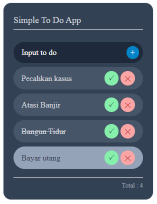

<h1 align="center">Simple To-Do App</h1>
<h3 align="center">A nice way to create tasks and save notes</h3>
<div align="center">
    
</div>

<p>A simple to do web app built with vuejs and tailwind css, just try it</p>

## Install
Clone the repo:

```bash
git clone https://github.com/nandajl/Todo-web-app.git
```

Go to the folder and install the requirements:

```bash
npm install
```

Run the app
```bash
npm run dev
```